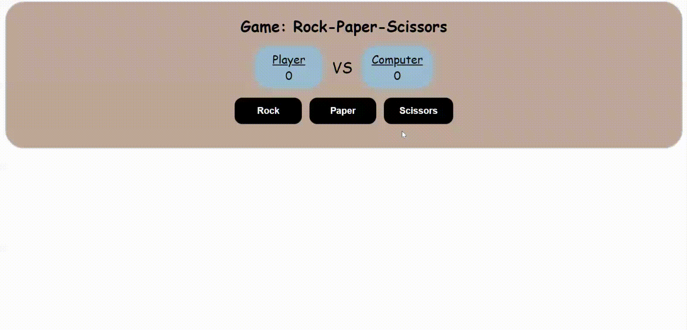

# Rock Paper Scissors Project at The Odin Project

## Rock Paper Scissors Game
This project is a simple yet engaging implementation of the classic game Rock Paper Scissors. It's a part of the Foundations course at The Odin Project, designed to teach and reinforce key web development concepts.

## Featues
* **User Interface:** A visually appealing and user-friendly interface that allows players to make their choices by clicking on rock, paper, or scissors.
* **Game Logic:** Implements the rules of Rock Paper Scissors, determining the winner of each round based on the players' choices.
* **Score Tracking:** Keeps track of the player's and computer's scores, updating them after each round.
* **Game End:** Announces the final winner after a predetermined number of rounds and provides an option to play again.

## How to Run
* Clone the repository to your local machine.
* Open the index.html file in your web browser.
* Start playing by clicking on one of the game options (rock, paper, or scissors).

## What I've Learned
* **HTML and CSS:** Gained a deeper understanding of HTML for structuring web pages and CSS for styling. Learned how to create responsive designs that look good on all devices.
* **JavaScript:** Enhanced my skills in JavaScript, focusing on DOM manipulation, event handling, and game logic implementation.
* **Project Structure:** Developed a better understanding of how to structure a web project, including separating concerns between HTML, CSS, and JavaScript files.
* **Debugging and Testing:** Practiced debugging and testing to ensure the game works as expected and is accessible to all users.

